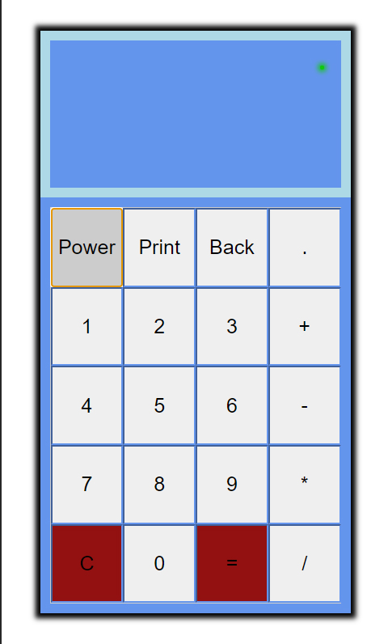

# Calc-with-printer
> Very simple and unfinished calc with printer simulator

## Table of contents
* [Colors key](#colors-key)
* [General info](#general-info)
* [Screenshots](#screenshots)
* [Technologies](#technologies)
* [Features](#features)
* [Inspiration](#inspiration)
* [Contact](#contact)

## Colors-key

## General info

When I started learn web programming I wanted to build my first bigger app - this calc. But I hadn't experienced to finished it and now I should rebuild it, beacause there are many simple and bad solutions.

## Screenshots

### Main view

## Technologies
* HTML
* CSS
* Javascript
* SCSS

## Features

To do:
* rebuild in the future

Live demo https://przemek-szadkowski.github.io/Calc-with-printer/

## Status
Project is: finished

## Inspiration
Project inspired by one of my first programming courses.

## Contact
Created by [przemoszadkowski@o2.pl](mailto:user@example.com) - feel free to contact me!